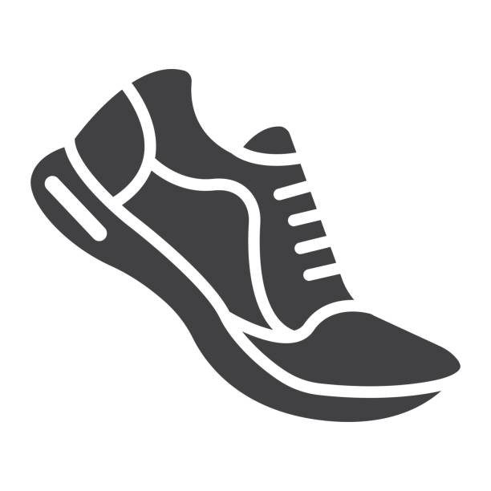

<h1 align="center"> Personalized Health </h1>

  

 <b>Robert Renecker - Jacob Munoz - Akshit Arora</b>

## The Idea and Mission Statement

The goal for our project is to build a personalized goal application for running. Given a broad spectrum ranging from never-have-run-before to I-run-every-day, a regression model will be able to provide inference to a recommendation that a potential runner should carry out in order to meet a goal. The goals may be weight loss or the ability to run a certain distance. By using this application, hopefully a potential runner will be able to achieve these goals in a way that is personalized to their health and ability.

The problem that we hope to solve is that right now, running for some people is difficult. However, most of the problem is just figuring out a realistic goal that will encourage them to attempt to run. By using this web-app, we hope to give them a realistic goal that may not be too difficult for them to do. Thus, it will encourage them to continue making progress towards a longer-term goal with which they feel proud of achieving.

As a team, we feel that this project is more than feasible given we understand our problem statement and we understand the data we are working with. The scope of our project isn’t too large and it encompasses minimal things which will make it possible to do with the time constraints we’ve been given.

In regards to our machine learning model, we believe that multiple linear regression will be a good interpreter for recommending goals to a potential runner because there is most likely a linear relationship between various features in ones health and that of their running ability.

The user will input some initial training data(how much are you currently running, age, weight, distance goal, more?) to provide some baseline for running experience. This will give them an initial running goal to attempt. The model will then collect data during the run(distance traveled vs. goal, heart rate, pace, more?) and adjust accordingly. We want our model to be able to adjust itself based on user performance. For example, if the user crushes the first goal given by the app, we want it to adjust and give the user a much more rigorous running plan. If the user struggled to reach the goal or didn’t complete the run, it should adjust accordingly to give a more reasonable goal. Ideally the app would underestimate rather than overestimate the user so as to not demotivate them!

## Challenges

Our biggest challenge right now is understanding the limitations/capabilities of the fitbit to figure out how to get real-time data. Originally we were going to use an apple watch to do that, but quickly learned this would require us to build and iOS exclusive app to stream the data (like here). That doesn’t sound fun. We know it is possible to request messages from fitbit with customizable arguments including what previous data we want(i.e. heart rate from the last 10 minutes.) We want to overcome the challenge of real-time monitoring/analysis by requesting data in close-enough-time. If we can GET streams of data every 30 seconds or so that should be close enough to real time to feed our model to provide the runner real-time feedback(i.e. “Your heart is about to explode, maybe take it down a notch!” or “I don’t think you’re actually running… pick it up!”)

Another challenge we face is quantifying user data into running capabilities and more generally how to quantify running ability as a whole. We will need to do some research to determine the input encoding to our ML model and what specific use-cases to focus on. There seems to be data out there regarding this information so hopefully we can successfully translate that information into an accurate model to build upon. Maybe we could get in touch with one of the many CU running clubs for some insider knowledge.

## The Technologies
- Tensorflow
  - Tensorflow is an open-source python library. It contains tons of different machine learning libraries that enable a user to create a state-of-the-art machine learning applications.
- Flask
  - Flask is a highly scalable micro web-framework available in python. It is extremely well documented and contains tons of examples to give a user all the information needed in order to get a web application up and running.
- Fitbit (or a sensor that provides real-time access to heartbeat)
  - To monitor user vitalities while running to update the user’s training buddy(model)

## Risks of failure

In regards to our machine learning model, if there is no linear relationship between the features a users health and that of our recommendations, then that will make it so we have to completely re-do our machine learning approach to find other relationships that may not be linear.

Fitbit is a technology that requires the hardware to be in working order. Like any other, there are things that we cannot control during demo times and during our data gathering and testing phases. We will have to make sure our data looks appropriate for the instance it is associated with.

## Ethical questions

The only ethical question we can see as of right now is our application providing unhealthy recommendations. If our model is over/under fit we could potentially provide someone with an overly intense running routine that could cause physical harm. If our app tells someone they should be able to run 10 miles on their first run and they attempt it, they could injure themselves based off of our recommendations. To avoid this we will have to conduct thorough running research to that we are able to gage our model’s suggestions and provide realistic goals for users.

## Open Source and Closed Source Components
1. Tensorflow (partly open sourced)
2. FitBit API (closed source)

## The Timeline

Week 8 - The Concept Phase
- User’s requirements.
- More specific than the data.
- What final project should look like.
- Extensive storyboarding / wireframing and storytelling wouldn’t be a bad addition.

Week 9 - The Planning Phase
- Talk with possible users.
- Write proposal.
- Iteration begins by end of week 9.

Week 10 - The Design & Development Phase
- Play with and learn new technologies.
- Set up and test fitbits.
- Begin Constructing regression model

Week 11
- Spring Break

Week 12
- Construct regression model.
- Think about webapp UI.
- Deliverable: A trained model(Potentially rough first iteration)

Week 13
- Strengthen the model, test internally
- Setup application framework
- Deliverable: A ‘better’ model; A skeleton of a webapp to expand on

Week 14
- Integrate our model with our application
- Application front-end
- Deliverable: An application with a ML model fully integrated

Week 15 - Presentation/Production Phase
- Demonstrate ability to use github ID with web application
- Demonstrate inference via regression model
- Demonstrate personalized recommendations

## Bibliography

Inspired by other teams' time table
