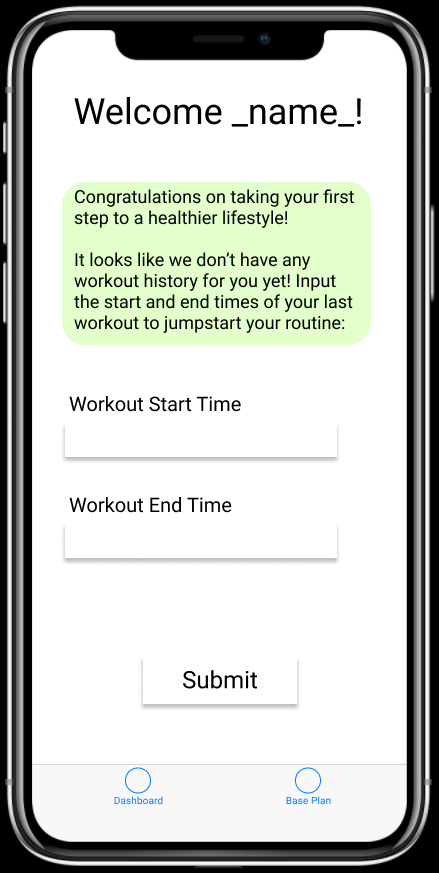
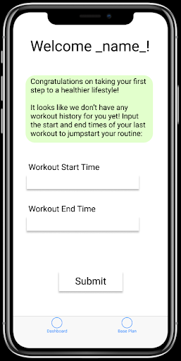
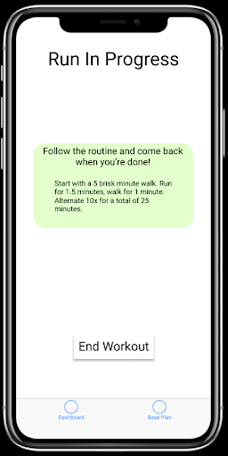
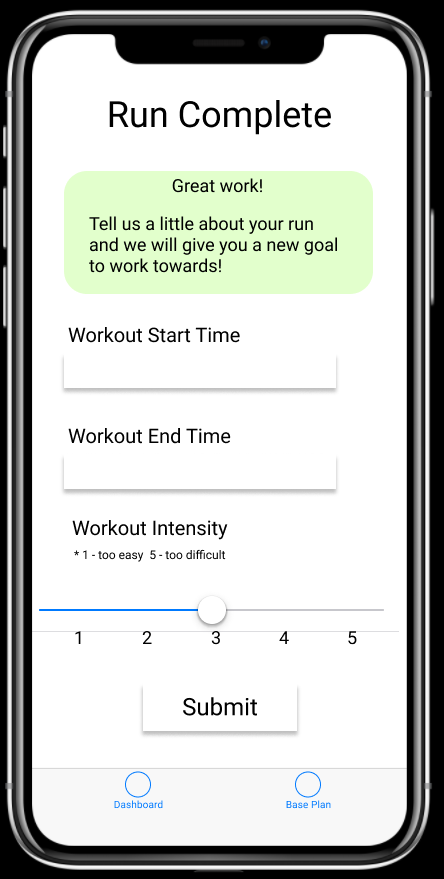
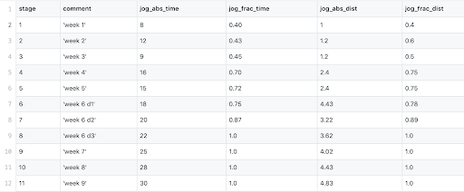
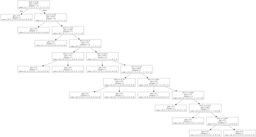
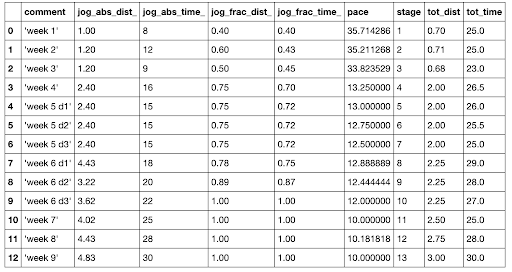
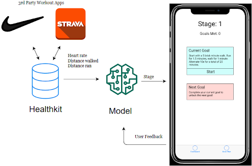

<h1 align="center"> Personalized Health </h1>

  

 <b>Robert Renecker - iOS Development</b>  
 <b>Akshit Arora - ML Design</b>  
 <b>Jacob Munoz - Interaction Design</b>    
 <b>CSCI 5880 - Machine Learning for Human-Computer Interaction</b>  
 <b>University of Colorado Boulder</b>  

## 1. The Idea and Mission Statement

The goal for our project was to build a personalized recommendation application for running. Given a broad spectrum, ranging from never-ran-before to running-every-day, we want the user to be able to use our application in order to get recommendations on how to increase their ability to run. This project uses a machine learning application and other essentials in order to achieve this goal.

We hope that for people who find running difficult they can gradually build their ability to run longer distances by using this application. Having an app that adjusts according to you and your tendencies will help to keep motivation and encourage consistency. A ‘one-size-fits-all’ running routine, as available in apps today [1][8], can only help so much. By personalizing one of these plans (Couch-to-5k[1]) to adjust to your personal performance we hope to provide a better experience.

## 2. User Experience
For new users the setup is quick, all we need is your name, age and permission to access your healthkit data. We use your age to determine your appropriate heart rate zone[4] and your name so we know what to call you! After that we will use your healthkit data to track your vitals during workouts so that we can adjust your routine accordingly.

After sign up, you will be asked to record a sample workout so that we can determine what stage you are at as a runner. For recording this sample workout you may go on a light run, without pushing yourself too hard, so that we can get an idea of your current running pace and heart rate.

  
   <i>Figure 2.1 : Prototype portrayal</i>

In order for us to access this workout information, you should use a third party data collection application (such as Nike Run, Strava etc.) to track your workouts and write them into healthkit datastore. These applications will record workout data that we can use to gauge your performance. You can then either manually enter in the start time or concurrently start the workout on the phone and then end it on the phone as well. 

At this point the application will provide your first personalized goal!

  
   <i>Figure 2.2 : Prototype portrayal</i>

  
   <i>Figure 2.3 : Prototype portrayal</i>

After each workout our application will retrieve your workout data and analyze it, looking to see if you are meeting your goals. We are looking to see that you walked and jogged the appropriate amount. We are also monitoring your heart rate to see if you are stressing your body more than natural.

  
   <i>Figure 2.4 : Prototype portrayal</i>

Additionally we are looking for your personal opinion on each goal. We ask for your feedback on difficulty for latest workout and cross reference with your workout data to determine how your next goal should be adjusted. If you felt the routine was too challenging the model will ease up on your next goal. If you felt it was not challenging enough your next goal will have increased difficulty.

Here are the heart rate zone[4] descriptions:
- Zone 1: 50 to 60 percent of maximum heart rate
- Zone 2: 60 to 70 percent of maximum heart rate
- Zone 3: 70 to 80 percent of maximum heart rate
- Zone 4: 80 to 90 percent of maximum heart rate
- Zone 5: 90 to 100 percent of maximum heart rate

Ideally for long runners, the heart rate zone must be between 1 and 2.

After you have met your goal and the model determines you are ready to move on, you will be given your next goal. Each goal is tailored to you and your performance and will grow with you as you become a more experienced runner!

## 3. Challenges
The challenges we encountered during this project have been great opportunities for us to learn and we describe them in this section with the intention of helping out someone who is looking to build a project in this direction. Here is a list of the challenges, we will explain each one separately as we move forward:
1. Data we can get vs data we need
2. Selecting an appropriate platform
3. Designing the lifecycle of such an application
4. Navigating Apple’s frameworks
5. Building Machine Learning model from scratch

### Data we can get vs data we need
We started off by building a draft list of features that we believed we would need to develop this kind of application (based on a Couch to 5k plan[1]):
1. Absolute Jogging Distance (jog_abs_dist) - absolute time spent in jogging in the entire workout
2. Fractional Jogging Distance (jog_frac_dist) - fraction of time spent during jogging in the entire workout
3. Absolute Jogging Time (jog_abs_time) - absolute distance covered in jogging in the entire workout
4. Fractional Jogging Time (jog_frac_time) - fraction of distance covered with jogging

The reason we chose these particular features were because they seemed to be the best indicators of the stage the user is at, in a couch to 5k plan (See Figure 3.1). We also wanted to integrate heart rate because of an article we read about ideal running heart rate zone[4]. 

  
   <i>Figure 3.1 : Synthetic dataset built from Couch to 5k plan[1]</i>

Unfortunately finding a suitable data was more difficult than anticipated. The input data we were looking for was a stray from the norm and we could not find all the pieces together. Furthermore, even if we have found a data set such as that, we would most likely be dealing with a data set that is exclusive to experienced runners. We want our model to be trained on data sets that include all levels of running in order to be able to get a use case where a user can have never ran before and be able to take advantage of our application.

To mitigate this we decided to bootstrap our own running data. This allowed us to get many combinations of distance walked vs.distance  jogged to train our model for each stage. 

### Selecting an appropriate platform

As stated before, we started exploring the platforms after selecting the features we believed we needed to build the model. We explored several options including:

-   FitBit

    -   We first explored the idea of making a fitbit application that would work inside a FitBit product. After some exploration, here are the reasons we decided not to pursue this particular idea:

        -   We had to make sure the app did not use a lot of resources resulting in battery loss.

        -   Interaction design is a bit complicated when it comes to smart watches in general

    -   We moved on to explore the idea of a web application, and yet again, after some exploration, here are the reasons we decided not to pursue it further:

        -   We needed live heart rate (as mentioned earlier), however the FitBit Web API[5] does not offer real-time heart rate data. Even the offline time-series data requires special access request to be approved in order to get started.

        -   In terms of compatibility, FitBit was not a part of any ecosystem of products, unlike Apple Watch/Xiaomi Bands/etc.

-   Apple Watch

    -   The requirement of getting live heart rate, led us to Apple Watch platform. Apple Watch OS provides access to live Heart Rate data. Although it also had similar shortcomings like interaction design as FitBit, we discovered some things that led us to finalize Apple Watch for this project:

        -   It is possible to make a single application that could run simultaneously on both Apple Watch OS (on Apple Watch) and iOS (on iPhone paired to that apple watch) and this was the major reason we decided to pursue this platform. An example of such application would be Strava, Nike+, Uber, Shazam etc.

        -   It was also possible to send and persist data across devices using Apple's WatchConnectivity Framework[6] that allows for communication between Apple Watch and iOS when the two devices are paired].

        -   Apple's healthkit framework[2] that stores data from multiple sources in a consistent manner and acts as a useful and persistent interface to access user's history of workouts.

-   Samsung Gear S4 / Xiaomi Watch

    -   Did not pursue these ideas because of lack of exposure to its hardware and software capabilities.

### Life-Cycle of the application

Since applications like Nike+, Strava, FitBit, C25k exist to help you track your workout, we could not find any application that would provide personalize the recommendations according to your physical health. This made it harder for us to visualize how our target application would fit into the health and fitness apps ecosystem such that it can make its unique contribution. We were looking to answer the following questions for ourselves:
1.  What exact use-cases would our application serve the user?

2.  How to collect and how much of information would be collected from Phone and Watch sensors?

3.  How would those sensors be fused together to serve some meaningful purpose towards our model?

As we progressed through more architecture iterations, we gradually started gaining clarity on how to answer these questions:
1.  We identified that the specific use-case for our app would be: given a workout data from healthkit, predict the stage the user is at using a machine learning model. And adjust those recommendations based on user feedback and their heart rate zone (as discussed section on System Architecture).

2.  We decided to outsource the task of collection of workout data to third party applications like Nike+/Strava etc. and focus on our particular use-case of providing personalized recommendations.

3.  This decision to outsource data collection led us to focus only on the data that the consistent API of healthkit provides us. We did not have to care about raw sensor data fusion anymore.

### iOS development learning curve / apple frameworks

As mentioned above, there were many design iterations to help answer some major architectural questions for our application. Such a process can be faster if the team is already well acquainted with iOS development ecosystem. But that was not our case, we were trying to do two things simultaneously:

1.  Design an application with an entirely new concept (hence no pre-existing tutorials were applicable)

2.  Learn the existing structure of iOS frameworks

We discovered that dealing with HealthKit data in iOS was very different from what we had seen before in web programming and other developer environments. The tasks we previously believed were trivial turned out to be non-trivial. In other words, this resulted in slower design iterations and hence delayed the timeline for our deliverables. We believe that this could have been faster, if we had experience with the typical iOS development before starting out this project.

### Building Machine Learning model from scratch

Every person is different and hence every person responds differently to any physical task. Since that is true, then why do we have fixed plans in existence? This warrants the need of modeling how a person responds to a physical task and hence machine learning could be used to identify patterns unique to an individual and give out recommendations accordingly.

We had this clarity from the beginning that machine learning was in-fact needed to solve this task and was not merely a silver bullet to solve this kind of task. But it was difficult building a model from scratch for solving this task because:

1.  There were no pre-existing datasets with the features we needed.

2.  We kept on running into plans similar to Couch-to-5k that had no personalization at all.

3.  Apple's createML framework had very limited choice of what type of ML models we could deploy (since CoreML tools[7] to convert sklearn models to .mlmodel were not working)

Given these constraints we decided to choose a decision tree model (See Figure 3.2).

  
   <i>Figure 3.2: Visualization of our decision tree model</i>

After gaining enough information about healthkit API, the features we eventually chose to work with are:

1.  Total Distance (tot_dist) in kms

2.  Total Time (tot_time) in minutes

3.  Pace (kms/min)

  
   <i>Figure 3.3: Features in the current iRun application</i>

We synthesized this dataset from couch to 5k plan. We also decided to use only average heart rate zone so as to determine the intensity of the work out. For exact details, see the next section on System Architecture.

## 4. System Architecture

  
   <i>Figure 4.1 : High level system architecture</i>

### Healthkit
Our application relies on iOS Healthkit for the user’s data because it is able to store data for any third party workout application. Our application can make a request to Healthkit and get the desired workout data in response such as heart rate, distance walked, and distance ran.

### Third Party Applications
The user is able to use and workout application they are currently using so long as they have allowed healthkit to access their data. These workout applications record the data mentioned above and more. 

### User Feedback
After each goal is met the user rate’s the goal difficulty on a scale of 1-5 that represents increasing difficulty with numbers. This simple scale can have a significant impact on your next routine if your workout data supports it.

### Model
After the application receives the Healthkit response the data is fed to the model. The model produces a new goal tailed to the user based on their workout data and personal feedback. The model uses the user’s heart rate to calculate their heart rate zone[4]. The model can determine if the user is pushing themselves too much, too little, or enough. The distance traveled(walking and running) is used for time spent walking vs. jogging to determine if the user followed the routine that was given to them. The feedback given by the user will have an impact on how much progression the model thinks the user has made when used alongside the workout data analysis. If the user’s feedback is supported by their workout data it will have a more significant impact.

## 5. The Technologies
1.  Apple Developer Frameworks - HealthKit, CreateML, CoreML

2.  Deployment - iPhone, Apple watch

3.  IDE - Xcode 10.0

4.  Language - Swift 4.0

5.  Figma - UX design tool

6.  Apple's HealthKit (closed source)

## 6. Risks Managed and Mitigated
-   ML Model: We anticipated this challenge from the beginning of this project and explored multiple perspectives (as described in Challenges section). We finally decided to stick to decision tree model trained on our synthetic dataset (obtained from couch-to-5k plan). We intend to use this application to collect data so that we can contribute a feature rich dataset to the research community.

-   FitBit: We initially tried working with the fitbit but quickly found they make it difficult to retrieve data and it was not the sort of data we were looking for. After further discussion our peers suggested Apple Watches as a better alternative and we shifted focus to iOS development.

-   iOS learning curve/data from healthkit: iOS development was new for everyone in the group and swift was more unique than expected. We spent time sharing resources and guides to complete our crash courses and continue with development.

## 7. Ethical/Safety questions
One of the major ethical questions that exist with our application are around unhealthy recommendations. Since the model behind this application is very simple as of this moment and the research is working on improving the recommendations, it would be safe for the users to keep a check with their respective doctors and only do the exercise within their physical limit to avoid any kind of injury.

## 8. Conclusion

### What we did
We built a minimum viable application that is capable of creating a unique running routine based on user performance and feedback. The app is capable of increasing or decreasing the difficulty required or maintaining the current routine that is working for the user. 

### What we learned
1.  How to pivot a project in different directions when things don't work

2.  Closing the loop first

1.  Going to what is available from healthkit and then making the model

4.  Identifying modules that can run in parallel vs what needs to be done sequentially

5.  Building an ML use case from scratch is ambitious but you should probably look for pretrained models/ blogs/ something.. And even evaluate if we need ml for everything

6.  Account for all possible outcomes

### Future Work
Our application is functionally solid however the UI was put on the back burner to focus on ML problems. A first step to improving the application would be to fully implement the prototype design. This would enhance the user’s experience.

Additionally, we would like to spend more time collecting data through the app in order to strengthen our model. We would like to replace our bootstrapped data with data we collected ourselves through the app!

Finally, we would like to posit our application as a data collection application to power future machine learning efforts in the academic and industry research communities. This would help us to iterate our model to achieve something that is more robust machine learning.

## 9. Bibliography
1.  Couch to 5K running plan ([link](https://crcphp.arizona.edu/sites/default/files/images/Couch-to-5k%20Running%20Plan.pdf))

2.  Apple HealthKit ([link](https://developer.apple.com/healthkit/))

3.  Figma ([link](https://www.figma.com/))

4.  Running Heart Rate Zone ([link](https://www.healthline.com/health/running-heart-rate#heart-rate-training))

5.  FitBit Heartrate API ([link](https://dev.fitbit.com/build/reference/web-api/heart-rate/))

6.  Apple's Watch Connectivity Framework ([link](https://developer.apple.com/documentation/watchconnectivity))

7.  CoreML Sk-learn connector ([link](https://apple.github.io/coremltools/generated/coremltools.converters.sklearn.convert.html))

8.  Nike Run Club app ([link](https://itunes.apple.com/us/app/nike-run-club/id387771637?mt=8))